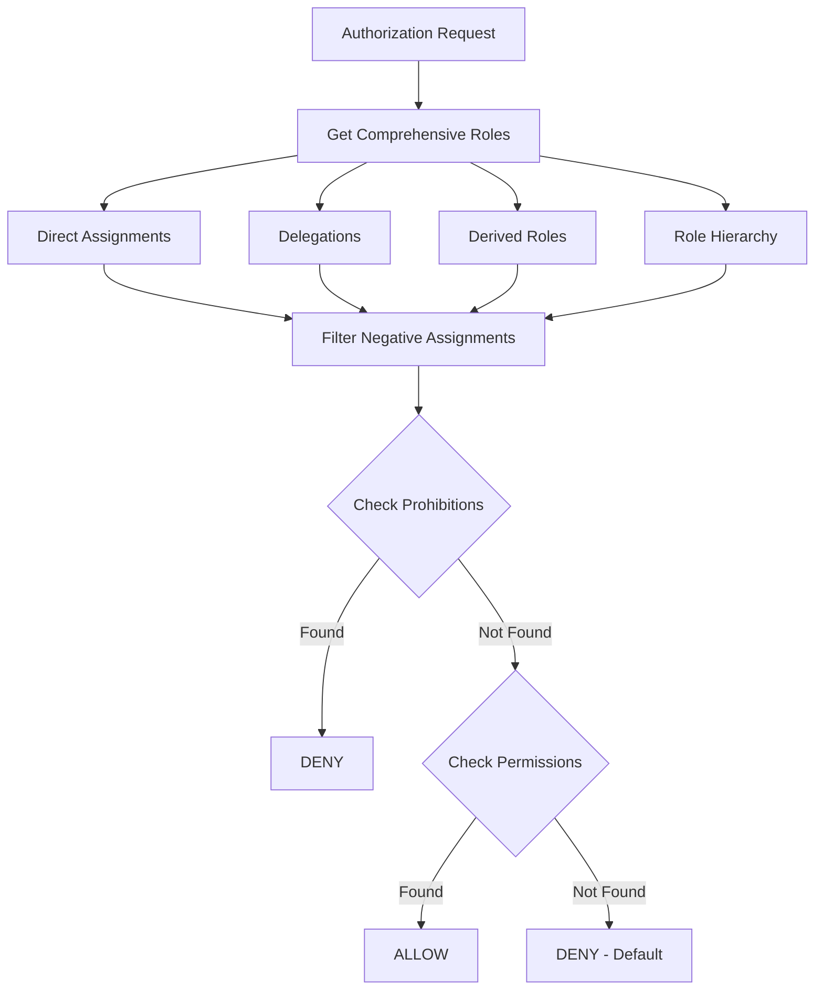
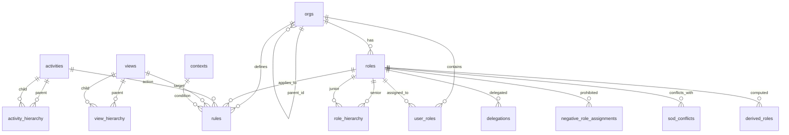
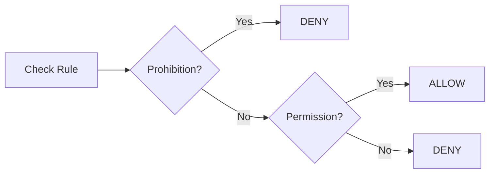
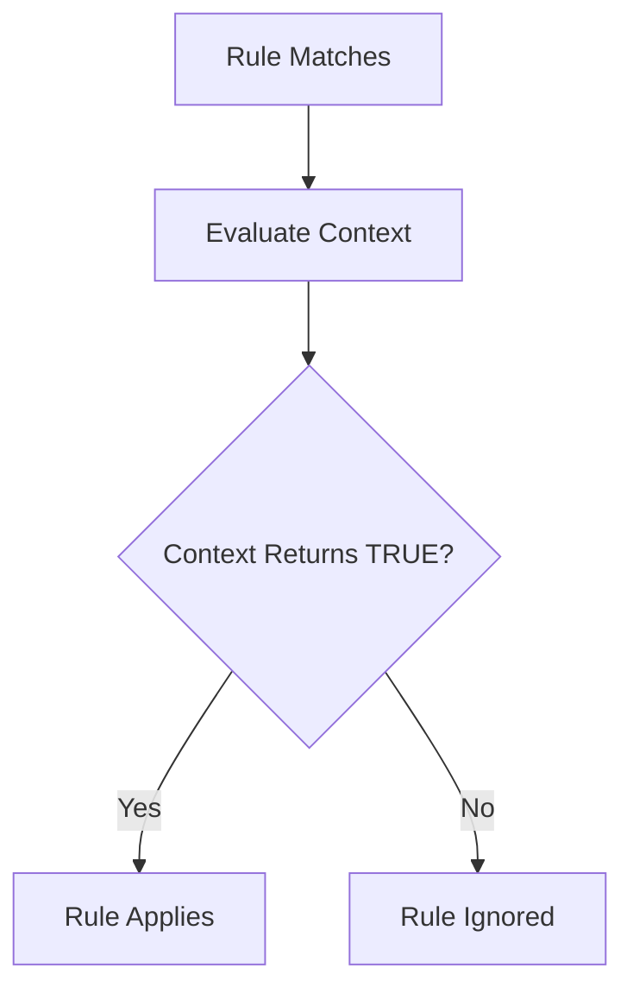
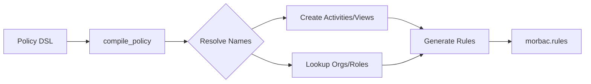
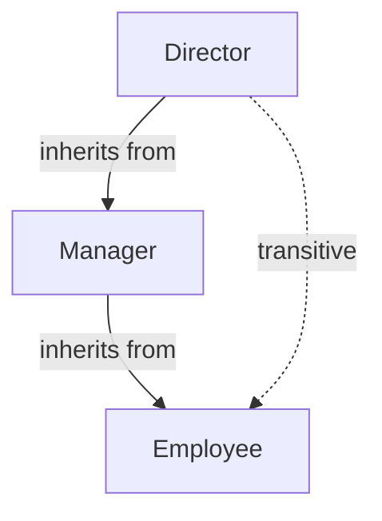

# pg_morbac Documentation

Complete technical documentation for the Multi-OrBAC PostgreSQL extension.

## Table of Contents

- [Architecture](#architecture)
- [Schema Reference](#schema-reference)
- [Core Concepts](#core-concepts)
- [Advanced Features](#advanced-features)
- [API Reference](#api-reference)
- [Integration Guides](#integration-guides)
- [Performance](#performance)
- [Security Model](#security-model)

## Architecture

### Design Principles

pg_morbac is built on these principles:

1. **Pure PostgreSQL**: No external dependencies (except pgcrypto)
2. **Schema Isolation**: All objects in `morbac` schema
3. **Default Deny**: No permission = access denied
4. **Prohibition Precedence**: Prohibitions checked first, always override permissions
5. **Organization-Centric**: All policies scoped to organizations
6. **Multi-Tenant Native**: Users and resources can span organizations

### Authorization Flow



### Performance Optimizations

**Prohibition-first checking:** Prohibitions are checked before permissions for early exit on denial.

**Indexed foreign keys:** All foreign key relationships have indexes for fast joins.

**Composite indexes:** Optimized indexes for common query patterns (org_id, role_id, activity, view).

**STABLE functions:** RLS functions are marked STABLE for transaction-level caching.

**Recursive CTEs:** Efficient hierarchy traversal using PostgreSQL's recursive common table expressions.

## Schema Reference

### Entity Relationship Diagram



### Core Tables

**morbac.orgs**: Organizations with hierarchy support (`parent_id` self-reference). Unique name required. Supports metadata as JSONB.

**morbac.roles**: Roles scoped to organizations. Unique `(org_id, name)` constraint ensures role names are unique within each org.

**morbac.role_hierarchy**: Role inheritance via `(senior_role_id, junior_role_id)`. Senior roles inherit all junior permissions. Supports transitive closure.

**morbac.user_roles**: Direct user-to-role assignments. Primary key on `(user_id, role_id, org_id)`. Note: `user_id` is external (application manages users).

**morbac.activities**: Abstract actions (global scope). Text primary key. Examples: `read`, `write`, `delete`, `approve`.

**morbac.activity_hierarchy**: Activity inheritance via `(parent_activity, child_activity)`. Permission to parent grants child activities.

**morbac.views**: Abstract object categories (global scope). Text primary key. Examples: `documents`, `reports`, `financial_data`.

**morbac.view_hierarchy**: View inheritance via `(parent_view, child_view)`. Access to parent grants child views.

**morbac.contexts**: Contextual conditions as callable predicates. Column `evaluator` (REGPROC) references a function returning BOOLEAN (preferably STABLE). Built-in context `always` returns true.

**morbac.rules**: Core policy rules linking org, role, activity, view, context, and modality. Indexed on `(org_id, role_id, activity, view, modality)` for fast lookups.

**morbac.policy**: Policy DSL using names instead of UUIDs. Insert here, then call `compile_policy()` to generate rules.

### Advanced Feature Tables

**morbac.delegations**

Temporal role delegation with time bounds.

**Key columns:**
- `delegator_user_id`: User granting the role
- `delegate_user_id`: User receiving the role
- `role_id`, `org_id`: Role being delegated
- `valid_from`, `valid_until`: Time window (NULL = indefinite)

**Behavior:** Automatically included in `get_comprehensive_roles()` when active.

**morbac.negative_role_assignments**

Explicit role prohibitions with highest precedence.

**Key columns:**
- `user_id`, `role_id`, `org_id`: Assignment to prohibit
- `reason`: Explanation for prohibition

**Behavior:** Overrides direct assignments, delegations, and derived roles.

**morbac.sod_conflicts**

Separation of Duty constraints enforce mutually exclusive roles.

**Key columns:**
- `role1_id`, `role2_id`: Conflicting role pair
- `org_id`: Organization scope
- `description`: Explanation of conflict

**Behavior:** Prevents users from holding both roles simultaneously. Validated via `check_sod_violation()` before role assignment.

**morbac.role_cardinality**

Constrains the number of users per role.

**Key columns:**
- `role_id`, `org_id`: Role to constrain
- `min_users`: Minimum required users (default 0)
- `max_users`: Maximum allowed users (NULL = unlimited)

**Behavior:** Validated via `check_cardinality_violation()` before role assignment.

**morbac.derived_roles**

Dynamically computed roles via custom functions.

**Key columns:**
- `role_id`, `org_id`: Role to compute
- `evaluator`: Function returning `TABLE(user_id UUID, org_id UUID)`
- `description`: Explanation of computation logic

**Behavior:** Function is called at runtime to determine role membership. Included in `get_comprehensive_roles()`.

**morbac.cross_org_rules**

Inter-organizational access policies.

**Key columns:**
- `source_org_id`: Organization where role is held
- `target_org_id`: Organization where access is granted
- `role_id`, `activity`, `view`: Policy specification
- `modality`: Permission or prohibition

**Behavior:** Allows roles in source organization to access resources in target organization.

**morbac.admin_rules**

Administration meta-policies for delegated management.

**Key columns:**
- `org_id`, `role_id`: Role receiving admin capabilities
- `can_manage_policies`: Can create/modify policies
- `can_manage_roles`: Can create/modify roles
- `can_manage_users`: Can assign/revoke user roles

**Behavior:** Enables organization-scoped administrators without database superuser privileges.

## Core Concepts

### Deontic Modalities

Multi-OrBAC implements four modalities:

1. **Permission**: Allows action (if no prohibition)
2. **Prohibition**: Denies action (always wins)
3. **Obligation**: Must be done (informational only)
4. **Recommendation**: Should be done (informational only)

Only permissions and prohibitions affect `is_allowed()` decisions.

**Evaluation Priority:**



**Example: Employee Document Access**

```sql
-- Employees can read documents
INSERT INTO morbac.rules (org_id, role_id, activity, view, modality)
VALUES (org_id, employee_role_id, 'read', 'documents', 'permission');

-- Suspended employees cannot (prohibition overrides permission)
INSERT INTO morbac.rules (org_id, role_id, activity, view, modality)
VALUES (org_id, suspended_role_id, 'read', 'documents', 'prohibition');

-- Check access
SELECT morbac.is_allowed(employee_id, org_id, 'read', 'documents'); -- TRUE
SELECT morbac.is_allowed(suspended_id, org_id, 'read', 'documents'); -- FALSE (prohibited)
```

### Context Evaluation

Contexts are boolean predicates that determine if a rule applies. They enable dynamic, condition-based access control.

**Context Evaluation Flow:**



**Example: Business Hours Context**

```sql
-- Create a context for business hours (Monday-Friday, 9am-5pm)
CREATE FUNCTION morbac.ctx_business_hours() RETURNS BOOLEAN STABLE AS $$
    SELECT EXTRACT(DOW FROM now()) BETWEEN 1 AND 5
       AND EXTRACT(HOUR FROM now()) BETWEEN 9 AND 17;
$$ LANGUAGE SQL;

INSERT INTO morbac.contexts (name, evaluator) VALUES
    ('business_hours', 'morbac.ctx_business_hours'::regproc);

-- Contractors can only work during business hours
INSERT INTO morbac.rules (org_id, role_id, activity, view, context_id, modality)
SELECT org_id, contractor_role_id, 'read', 'documents', id, 'permission'
FROM morbac.contexts WHERE name = 'business_hours';
```

**Context Best Practices:**

- Use STABLE (not VOLATILE) for RLS compatibility
- Keep logic simple and fast
- Avoid external dependencies
- Consider caching if computation is expensive
- Return FALSE on errors for safe defaults
- Test thoroughly as contexts affect security

### Policy DSL

The Policy DSL provides a simplified way to declare policies using human-readable names instead of UUIDs, making policy management more intuitive.

**DSL Compilation Flow:**



**Example: Simple Policy Setup**

```sql
-- Use names instead of UUIDs
INSERT INTO morbac.policy (org_name, role_name, activity, view, modality) VALUES
    ('Acme Corp', 'employee', 'read', 'documents', 'permission');

-- Compile into actual rules
SELECT * FROM morbac.compile_policy();
```

**Compiler Behavior:**

- Creates missing activities/views automatically
- Resolves names to UUIDs for orgs/roles/contexts
- Creates entries in `morbac.rules` table
- Reports errors for missing orgs/roles/contexts
- Safe to run multiple times (idempotent)
- Returns detailed results for each policy

**When to Use Policy DSL vs Direct Rules:**

- **Use Policy DSL**: Initial setup, bulk imports, human-readable policy files
- **Use Direct Rules**: Dynamic policies, application-generated rules, when you already have UUIDs

## Advanced Features

### Hierarchies

Organizations, roles, activities, and views support hierarchical relationships with transitive closure.



**Example: Role Hierarchy**

Managers inherit all employee permissions:

```sql
-- Create role hierarchy
INSERT INTO morbac.role_hierarchy (senior_role_id, junior_role_id)
VALUES (manager_role_id, employee_role_id);

-- Grant permission to employees
INSERT INTO morbac.rules (org_id, role_id, activity, view, modality)
VALUES (org_id, employee_role_id, 'read', 'documents', 'permission');

-- Managers automatically get 'read documents' through inheritance
SELECT morbac.is_allowed(manager_id, org_id, 'read', 'documents'); -- TRUE
```

### Delegation

Temporary role delegation with time bounds.

**Example: Vacation Delegation**

Alice delegates her approver role to Bob for one week:

```sql
INSERT INTO morbac.delegations (
    delegator_user_id, delegate_user_id, role_id, org_id, valid_until
) VALUES (
    alice_id, bob_id, approver_role_id, org_id, NOW() + INTERVAL '7 days'
);

-- Bob can now approve during this period
SELECT morbac.is_allowed(bob_id, org_id, 'approve', 'requests'); -- TRUE (until expires)
```

### Negative Role Assignments

Explicitly revoke roles with highest precedence.

**Example: Suspended Admin**

Temporarily suspend an admin without removing the role:

```sql
INSERT INTO morbac.negative_role_assignments (user_id, role_id, org_id, reason)
VALUES (alice_id, admin_role_id, org_id, 'Under investigation');

-- Alice loses admin access even though role assignment remains
SELECT morbac.is_allowed(alice_id, org_id, 'manage', 'users'); -- FALSE
```

### Separation of Duty

Prevents users from holding conflicting roles.

**Example: Invoice Approval**

The same person cannot both create and approve invoices:

```sql
-- Define the conflict
INSERT INTO morbac.sod_conflicts (role1_id, role2_id, org_id, description)
VALUES (creator_role_id, approver_role_id, org_id, 'Cannot create and approve');

-- Check before assigning approver role to Alice (who is already a creator)
SELECT morbac.check_sod_violation(alice_id, org_id);
-- Returns: ['invoice_creator', 'invoice_approver'] if conflict would occur
```

### Cardinality Constraints

Enforce minimum and maximum users per role.

**Example: Admin Count Limits**

Require 2-5 administrators at all times:

```sql
INSERT INTO morbac.role_cardinality (role_id, org_id, min_users, max_users)
VALUES (admin_role_id, org_id, 2, 5);

-- Check before adding/removing admins
SELECT morbac.check_cardinality_violation(admin_role_id, org_id);
-- Returns: error message if would violate constraint, NULL if valid
```

### Derived Roles

Roles computed dynamically from application data.

**Example: Project Leaders**

Automatically grant project_lead role to users leading projects:

```sql
-- Function returns users who are project leaders
CREATE FUNCTION morbac.eval_project_leads()
RETURNS TABLE(user_id UUID, org_id UUID) STABLE AS $$
    SELECT lead_user_id, org_id FROM app.projects WHERE lead_user_id IS NOT NULL;
$$ LANGUAGE SQL;

INSERT INTO morbac.derived_roles (role_id, org_id, evaluator)
VALUES (project_lead_role_id, org_id, 'morbac.eval_project_leads'::regproc);

-- Users automatically get project_lead permissions when they lead a project
```

### Cross-Organizational Rules

Grant access across organization boundaries.

**Example: Corporate Auditor**

Global auditors can review subsidiary financial data:

```sql
INSERT INTO morbac.cross_org_rules (
    source_org_id, target_org_id, role_id, activity, view, modality
) VALUES (
    global_hq_id, subsidiary_id, auditor_role_id, 'read', 'financials', 'permission'
);

-- Auditor from Global HQ can now access Subsidiary data
SELECT morbac.is_allowed(auditor_id, subsidiary_id, 'read', 'financials'); -- TRUE
```

### Administration Rules

Delegate administrative capabilities to specific roles.

**Example: HR Manager**

HR can assign users to roles without being a superuser:

```sql
-- Grant HR the ability to manage user role assignments
INSERT INTO morbac.admin_rules (org_id, role_id, can_manage_users)
VALUES (org_id, hr_manager_role_id, true);

-- Check if HR user can assign roles
SELECT morbac.is_admin_allowed(hr_user_id, org_id, 'manage_users'); -- TRUE
```

### Temporal Constraints

Rules can have time-based validity periods.

**Example: Contractor Access**

Grant contractor access for Q1 2024 only:

```sql
INSERT INTO morbac.rules (org_id, role_id, activity, view, modality, valid_from, valid_until)
VALUES (org_id, contractor_role_id, 'read', 'documents', 'permission',
        '2024-01-01', '2024-03-31');

-- Rule automatically inactive after March 31, 2024
```

### Audit Logging

Comprehensive audit trail for security-critical operations. The audit system tracks all INSERT, UPDATE, and DELETE operations on specified tables.

**Audit log table structure:**

```sql
morbac.audit_log (
    id              BIGSERIAL PRIMARY KEY,
    timestamp       TIMESTAMPTZ,      -- When change occurred
    user_id         UUID,             -- User making change (if applicable)
    org_id          UUID,             -- Organization context
    table_name      TEXT,             -- Table being modified
    operation       TEXT,             -- INSERT, UPDATE, DELETE
    record_id       UUID,             -- ID of affected record
    old_data        JSONB,            -- Record state before change (UPDATE/DELETE)
    new_data        JSONB,            -- Record state after change (INSERT/UPDATE)
    changed_fields  TEXT[],           -- List of modified columns (UPDATE)
    session_user    TEXT,             -- PostgreSQL session user
    client_addr     INET,             -- Client IP address
    application_name TEXT,            -- Application name from connection
    metadata        JSONB             -- Additional custom metadata
)
```

**Enabling audit logging:**

```sql
-- Enable auditing on user_roles table
SELECT morbac.enable_audit('user_roles');

-- Enable auditing on multiple tables
SELECT morbac.enable_audit('rules');
SELECT morbac.enable_audit('delegations');
SELECT morbac.enable_audit('admin_rules');
```

**Disabling audit logging:**

```sql
SELECT morbac.disable_audit('user_roles');
```

**Querying audit log:**

```sql
-- Recent changes to user_roles
SELECT
    timestamp,
    operation,
    session_user,
    old_data->>'role_id' AS old_role,
    new_data->>'role_id' AS new_role
FROM morbac.audit_log
WHERE table_name = 'user_roles'
ORDER BY timestamp DESC
LIMIT 20;

-- All changes by specific user
SELECT * FROM morbac.audit_log
WHERE user_id = '123e4567-e89b-12d3-a456-426614174000'
ORDER BY timestamp DESC;

-- Changes to specific record
SELECT * FROM morbac.audit_log
WHERE table_name = 'rules' AND record_id = rule_uuid
ORDER BY timestamp;

-- Detect field-level changes
SELECT
    timestamp,
    record_id,
    changed_fields,
    old_data,
    new_data
FROM morbac.audit_log
WHERE table_name = 'rules'
  AND operation = 'UPDATE'
  AND 'modality' = ANY(changed_fields);
```

**Best practices:**
- Enable auditing on security-critical tables: `user_roles`, `rules`, `delegations`, `admin_rules`, `sod_conflicts`
- Create indexes on frequently queried columns: `CREATE INDEX ON morbac.audit_log(table_name, timestamp DESC)`
- Implement retention policies to archive old audit logs
- Use JSONB operators to query `old_data` and `new_data` efficiently
- Consider partitioning `audit_log` by timestamp for large installations

## API Reference

### Authorization Functions

**`is_allowed(user_id, org_id, activity, view)`**: Main authorization decision. Returns BOOLEAN. Checks prohibitions first, then permissions, defaults to deny.

```sql
SELECT morbac.is_allowed(user_uuid, org_uuid, 'read', 'documents');
```

**`get_comprehensive_roles(user_id, org_id)`**: Returns all roles for user (direct, delegated, derived, hierarchy, minus negative assignments).

**`get_effective_roles(user_id, org_id)`**: Alias for `get_comprehensive_roles()`.

### Hierarchy Functions

**`get_org_ancestors(org_id)`**: Returns all parent organizations with depth.

**`get_org_descendants(org_id)`**: Returns all child organizations with depth.

**`get_inherited_roles(role_id)`**: Returns all junior roles (transitive).

**`get_effective_activities(activity)`**: Returns activity plus all child activities.

**`get_effective_views(view)`**: Returns view plus all child views.

### Validation Functions

**`check_sod_violation(user_id, org_id)`**: Returns empty array if valid, or array of conflicting role name pairs if violations exist.

**`check_cardinality_violation(role_id, org_id)`**: Returns error message if constraint violated, NULL if valid.

### Administration Functions

**`is_admin_allowed(user_id, org_id, capability)`**: Check administrative permissions. Capabilities: `manage_policies`, `manage_roles`, `manage_users`.

**`eval_derived_role(user_id, org_id, derived_role_id)`**: Evaluate if user has derived role.

### Context Functions

**`eval_context(context_id)`**: Evaluate a context predicate.

### Policy DSL Functions

**`compile_policy()`**: Compile policy DSL into rules. Returns TABLE with success status and messages. Idempotent.

### RLS Helper Functions

**`current_user_id()`**: Get user ID from `request.header.x-user-id` (PostgREST) or `current_setting('morbac.user_id')`.

**`current_org_id()`**: Get org ID from `request.header.x-org-id` (PostgREST) or `current_setting('morbac.org_id')`.

**`rls_check(activity, view)`**: Authorization check for RLS policies using current user/org context.

```sql
CREATE POLICY my_policy ON app.table
FOR SELECT USING (morbac.rls_check('read', 'documents'));
```

### Informational Functions

**`pending_obligations(user_id, org_id)`**: Returns obligations for user (informational only).

**`pending_recommendations(user_id, org_id)`**: Returns recommendations for user (informational only).

**`user_has_role(user_id, org_id, role_name)`**: Check if user has specific role by name.

```sql
morbac.user_has_role(
    p_user_id UUID,
    p_org_id UUID,
    p_role_name TEXT
) RETURNS BOOLEAN
```

## Integration Guides

### PostgREST Integration

Configure PostgREST to pass user/org context via headers:

```nginx
# Nginx config
proxy_set_header X-User-Id $user_id;
proxy_set_header X-Org-Id $org_id;
```

Enable RLS and grant permissions:

```sql
ALTER TABLE app.documents ENABLE ROW LEVEL SECURITY;

GRANT USAGE ON SCHEMA morbac TO postgrest_role;
GRANT SELECT ON ALL TABLES IN SCHEMA morbac TO postgrest_role;
GRANT EXECUTE ON ALL FUNCTIONS IN SCHEMA morbac TO postgrest_role;
```

Create RLS policies:

```sql
CREATE POLICY document_read ON app.documents
FOR SELECT
USING (morbac.rls_check('read', 'documents'));

CREATE POLICY document_write ON app.documents
FOR INSERT
WITH CHECK (morbac.rls_check('write', 'documents'));
```

Alternative method using session variables:

```sql
SET morbac.user_id = '123e4567-e89b-12d3-a456-426614174000';
SET morbac.org_id = '987fcdeb-51a2-43d7-9c6e-5a8b7c9d0e1f';
```

### Application Integration

Python example:

```python
import psycopg2
conn = psycopg2.connect("dbname=mydb")
cursor = conn.cursor()
cursor.execute("SET morbac.user_id = %s", [user_id])
cursor.execute("SET morbac.org_id = %s", [org_id])
cursor.execute("SELECT * FROM app.documents")  # RLS enforced
```

Node.js example:

```javascript
const client = await pool.connect();
await client.query('SET morbac.user_id = $1', [userId]);
await client.query('SET morbac.org_id = $1', [orgId]);
const res = await client.query('SELECT * FROM app.documents');
```

### Multi-Organization Resources

Resources can belong to multiple organizations using a junction table:

```sql
-- Application defines document-org relationships
-- morbac.rls_check() enforces access rules
CREATE POLICY doc_access ON app.documents FOR SELECT USING (
    EXISTS (
        SELECT 1 FROM app.document_orgs
        WHERE document_id = app.documents.id
          AND org_id = morbac.current_org_id()
    )
    AND morbac.rls_check('read', 'documents')
);
```

## Performance

### Optimization Strategies

Prohibition-first checking provides early exit on denial for both security and performance.

For large hierarchies, use materialized views:

```sql
CREATE MATERIALIZED VIEW morbac.mv_role_closure AS
SELECT senior_role_id, junior_role_id FROM ...;
CREATE INDEX ON morbac.mv_role_closure(senior_role_id);
REFRESH MATERIALIZED VIEW morbac.mv_role_closure;
```

Context optimization:
- Use STABLE functions (not VOLATILE) for RLS caching
- Avoid expensive computations or external calls
- Keep context logic simple

All foreign keys are indexed. Critical composite indexes exist on `(user_id, org_id)` and `(org_id, role_id, activity, view, modality)`.

### Benchmarking

Example query performance (1M rules, 10K users, 100 orgs):

```sql
-- Simple authorization check
EXPLAIN ANALYZE
SELECT morbac.is_allowed(user_id, org_id, 'read', 'documents');
-- Typical: 5-15ms

-- With hierarchies (3 levels)
EXPLAIN ANALYZE
SELECT morbac.is_allowed(user_id, org_id, 'read', 'documents');
-- Typical: 10-30ms

-- RLS query (1M rows)
EXPLAIN ANALYZE
SELECT * FROM app.documents WHERE morbac.rls_check('read', 'documents');
-- Depends on selectivity, uses indexes
```

## Security Model

### Threat Model

Protected against:
- Unauthorized access (default deny)
- Privilege escalation (prohibition precedence)
- SQL injection (parameterized queries)
- Org boundary violations (explicit cross-org rules)

Not protected against:
- Malicious context functions (trusted code)
- Database user privilege escalation (PostgreSQL security model)
- Time-of-check/time-of-use races (transaction-based consistency only)

### Security Best Practices

**Context Function Security**

```sql
-- BAD: Leaks information
CREATE FUNCTION morbac.bad_context()
RETURNS BOOLEAN VOLATILE AS $$
    SELECT EXISTS(SELECT 1 FROM sensitive_table);
$$;

-- GOOD: Self-contained, stable
CREATE FUNCTION morbac.good_context()
RETURNS BOOLEAN STABLE AS $$
    SELECT EXTRACT(HOUR FROM CURRENT_TIME) BETWEEN 9 AND 17;
$$;
```

**User ID Validation**

```sql
-- Validate user exists before authorization
SELECT morbac.is_allowed(
    user_id,  -- Must be from authenticated session
    org_id,
    activity,
    view
);
```

**Org Context Validation**

```sql
-- Verify user belongs to org
SELECT EXISTS(
    SELECT 1 FROM morbac.user_roles
    WHERE user_id = ? AND org_id = ?
);
```

### Comparison: Multi-OrBAC vs Traditional RBAC

| Aspect | Traditional RBAC | Multi-OrBAC (pg_morbac) |
|--------|-----------------|-------------------------|
| **Multi-tenancy** | Single tenant or complex workarounds | Native multi-organization |
| **Prohibition** | No standard support | First-class, always wins |
| **Context** | Static permissions | Dynamic, condition-based |
| **Hierarchy** | Basic (roles only) | Full (orgs, roles, activities, views) |
| **Delegation** | Manual implementation | Native temporal delegation |
| **SoD** | Application logic | Database-enforced constraints |
| **Cross-tenant** | Not supported | Native cross-org rules |
| **Audit** | Application layer | Meta-policies (admin rules) |

---

## Additional Resources

- [Multi-OrBAC Research Paper](https://webhost.laas.fr/TSF/deswarte/Publications/06427.pdf)
