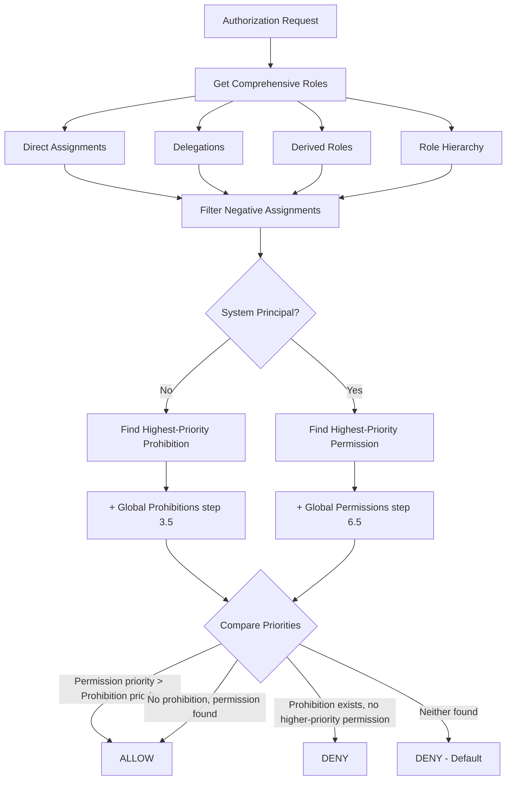
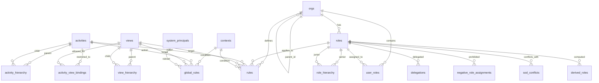
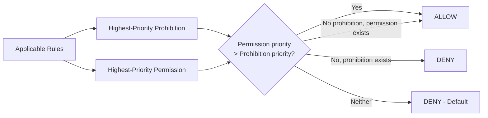
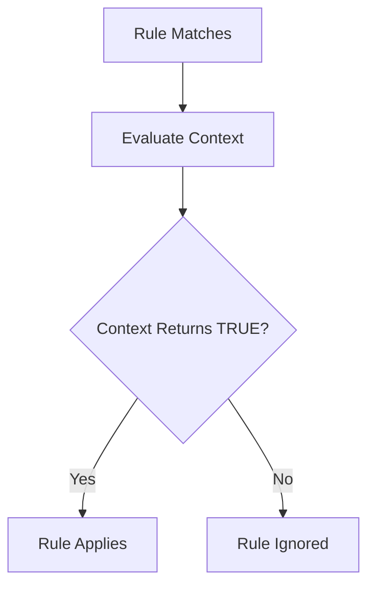
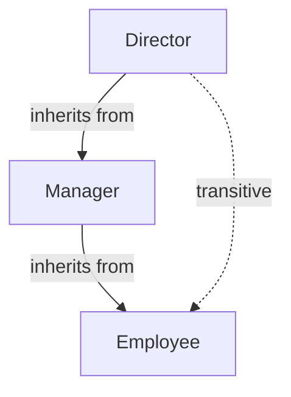

# pgmorbac Documentation

Complete technical documentation for the Multi-OrBAC PostgreSQL extension.

## Table of Contents

- [Architecture](#architecture)
- [Schema Reference](#schema-reference)
- [Core Concepts](#core-concepts)
- [Advanced Features](#advanced-features)
- [API Reference](#api-reference)
- [Integration Guides](#integration-guides)
- [Performance](#performance)
- [Security Model](#security-model)

## Architecture

### Design Principles

pgmorbac is built on these principles:

1. **Pure PostgreSQL**: No external dependencies
2. **Schema Isolation**: All objects in `morbac` schema
3. **Default Deny**: No permission = access denied
4. **Prohibition Precedence**: Prohibitions override permissions at equal or unset priority; a permission with strictly higher priority wins
5. **Organization-Centric**: All rules scoped to organizations
6. **Multi-Tenant Native**: Users and resources can span organizations

### Authorization Flow



### Performance Optimizations

**Priority-based evaluation:** Both prohibitions and permissions are evaluated; the higher-priority rule wins. At equal or unset priority, prohibition overrides permission.

**Indexed foreign keys:** All foreign key relationships have indexes for fast joins.

**Composite indexes:** Optimized indexes for common query patterns (org_id, role_id, activity, view).

**STABLE functions:** RLS functions are marked STABLE for transaction-level caching.

**Recursive CTEs:** Efficient hierarchy traversal using PostgreSQL's recursive common table expressions.

## Schema Reference

### Entity Relationship Diagram



### Core Tables

**morbac.orgs**: Organizations with hierarchy support (`parent_id` self-reference). Unique name required. Supports metadata as JSONB.

**morbac.roles**: Roles scoped to organizations. Unique `(org_id, name)` constraint ensures role names are unique within each org.

**morbac.role_hierarchy**: Role inheritance via `(senior_role_id, junior_role_id)`. Senior roles inherit all junior permissions. Supports transitive closure.

**morbac.user_roles**: Direct user-to-role assignments. Primary key on `(user_id, role_id, org_id)`. Note: `user_id` is external (application manages users).

**morbac.activities**: Abstract actions (global scope). Text primary key. Examples: `read`, `write`, `delete`, `approve`.

**morbac.activity_hierarchy**: Activity inheritance via `(senior_activity, junior_activity)`. Permission on a senior activity also grants junior activities.

**morbac.views**: Abstract object categories (global scope). Text primary key. Examples: `documents`, `reports`, `financial_data`.

**morbac.view_hierarchy**: View inheritance via `(senior_view, junior_view)`. Access on a senior view also grants junior views.

**morbac.contexts**: Contextual conditions as callable predicates. Column `evaluator` (REGPROC) references a function returning BOOLEAN (preferably STABLE). Built-in context `always` returns true.

**morbac.rules**: Core rules linking org, role, activity, view, context, modality, and scope. The `scope` column (default `'self'`) controls which orgs the rule covers relative to `org_id` — evaluated at query time so new child orgs are picked up automatically without re-inserting rules.


### Advanced Feature Tables

**morbac.delegations**

Temporal role delegation with time bounds.

**Key columns:**
- `delegator_id`: User granting the role
- `delegatee_id`: User receiving the role
- `role_id`, `org_id`: Role being delegated
- `valid_from`, `valid_until`: Time window

**Behavior:** Automatically included in `get_comprehensive_roles()` when active.

**morbac.negative_role_assignments**

Explicit role prohibitions with highest precedence.

**Key columns:**
- `user_id`, `role_id`, `org_id`: Assignment to prohibit
- `reason`: Explanation for prohibition

**Behavior:** Overrides direct assignments, delegations, and derived roles.

**morbac.sod_conflicts**

Separation of Duty constraints enforce mutually exclusive roles.

**Key columns:**
- `role_a_id`, `role_b_id`: Conflicting role pair
- `org_id`: Organization scope
- `description`: Explanation of conflict

**Behavior:** Prevents users from holding both roles simultaneously. Validated via `check_sod_violation()` before role assignment.

**morbac.role_cardinality**

Constrains the number of users per role.

**Key columns:**
- `role_id`: Role to constrain (primary key)
- `min_users`: Minimum required users (NULL = no minimum)
- `max_users`: Maximum allowed users (NULL = unlimited)

**Behavior:** Validated via `check_cardinality_violation()` before role assignment.

**morbac.derived_roles**

Dynamically computed roles via custom functions.

**Key columns:**
- `role_id`: Role to compute (primary key)
- `condition_evaluator`: Function `f(user_id UUID, org_id UUID) RETURNS BOOLEAN`
- `description`: Explanation of computation logic

**Behavior:** Function is called at runtime to determine if a user has the role. Included in `get_comprehensive_roles()`.

**morbac.cross_org_rules**

Inter-organizational access rules.

**Key columns:**
- `source_org_id`: Organization where the user must hold the role
- `target_org_id`: Organization where access is granted
- `role_id`, `activity`, `view`: Rule specification
- `context_id`: Contextual condition
- `modality`: Permission or prohibition

**Behavior:** Allows roles in a source organization to access resources in a target organization.

**morbac.system_principals**

Registry of backend service accounts. Registered user UUIDs are protected at the trigger level — no role assignment, rule, delegation, or prohibition can target them. Their permission rules in `global_rules` are equally immutable.

**Key columns:**
- `user_id`: UUID of the service account
- `description`: Human-readable label

**Behavior:** System principals bypass all prohibition evaluation. Only the DB owner can insert or remove entries (no RLS write policies).

**morbac.global_rules**

System-wide rules with no org or role binding.

**Key columns:**
- `user_id`: NULL = all users; non-NULL = specific user
- `activity`: NULL = any activity; non-NULL = specific activity (hierarchy applies)
- `view`: NULL = any view; non-NULL = specific view (hierarchy applies)
- `context_id`: Contextual condition
- `modality`: Permission or prohibition
- `priority`: Optional; same resolution semantics as `morbac.rules`

**Behavior:** Evaluated at steps 3.5 (prohibitions) and 6.5 (permissions) in `is_allowed_nocache()`. NULL on `activity` or `view` matches any value — no hierarchy setup required for broad rules.

**morbac.activity_view_bindings**

Optional whitelist of valid (activity, view) pairs for rule creation.

**Key columns:**
- `activity`: Activity to restrict
- `view`: Permitted view for that activity

**Behavior:** Opt-in per activity. If any binding exists for an activity, rules (including cross-org rules) can only use listed views. Activities with no bindings are unconstrained. Enforced at the database level via triggers on `morbac.rules` and `morbac.cross_org_rules`.

```sql
-- Restrict 'approve' to invoices and contracts only
INSERT INTO morbac.activity_view_bindings (activity, view) VALUES
    ('approve', 'invoices'),
    ('approve', 'contracts');

-- This succeeds
INSERT INTO morbac.rules (..., activity, view, ...) VALUES (..., 'approve', 'invoices', ...);

-- This raises an exception
INSERT INTO morbac.rules (..., activity, view, ...) VALUES (..., 'approve', 'user_profiles', ...);

-- Remove all bindings to lift the restriction
DELETE FROM morbac.activity_view_bindings WHERE activity = 'approve';
```

## Core Concepts

### Deontic Modalities

Multi-OrBAC implements four modalities:

1. **Permission**: Allows action (if no higher-or-equal-priority prohibition)
2. **Prohibition**: Denies action (wins at equal or unset priority; loses to higher-priority permission)
3. **Obligation**: Must be done (informational only)
4. **Recommendation**: Should be done (informational only)

Only permissions and prohibitions affect `is_allowed()` decisions.

**Evaluation Priority:**



**Obligations and Recommendations**

Obligations and recommendations do not affect access control, they are informational signals your application reads and acts on.

- **Obligation**: the user *must* perform this action. Use it to model required tasks, workflow steps, or compliance actions (e.g. a doctor must file a discharge report, an employee must review the security policy weekly).
- **Recommendation**: the user *should* consider this action. Use it for suggested next steps, nudges, or guidance (e.g. a manager is recommended to review team performance reports monthly).

Query them via `pending_obligations()` and `pending_recommendations()` to drive task lists, alerts, or workflow gates in your application.

**Conflict resolution**: a prohibition voids any applicable obligation. A prohibition or obligation voids any applicable recommendation. This mirrors the deontic priority order from the Multi-OrBAC paper: prohibition > obligation > recommendation.

**Example: Employee Document Access**

```sql
-- Employees can read documents
INSERT INTO morbac.rules (org_id, role_id, activity, view, modality)
VALUES (org_id, employee_role_id, 'read', 'documents', 'permission');

-- Suspended employees cannot (prohibition overrides permission)
INSERT INTO morbac.rules (org_id, role_id, activity, view, modality)
VALUES (org_id, suspended_role_id, 'read', 'documents', 'prohibition');

-- Check access
SELECT morbac.is_allowed(employee_id, org_id, 'read', 'documents'); -- TRUE
SELECT morbac.is_allowed(suspended_id, org_id, 'read', 'documents'); -- FALSE (prohibited)
```

### Context Evaluation

Contexts are boolean predicates that determine if a rule applies. They enable dynamic, condition-based access control.

**Context Evaluation Flow:**



**Example: Business Hours Context**

```sql
-- Create a context for business hours (Monday-Friday, 9am-5pm)
CREATE FUNCTION morbac.ctx_business_hours() RETURNS BOOLEAN STABLE AS $$
    SELECT EXTRACT(DOW FROM now()) BETWEEN 1 AND 5
       AND EXTRACT(HOUR FROM now()) BETWEEN 9 AND 17;
$$ LANGUAGE SQL;

INSERT INTO morbac.contexts (name, evaluator) VALUES
    ('business_hours', 'morbac.ctx_business_hours'::regproc);

-- Contractors can only work during business hours
INSERT INTO morbac.rules (org_id, role_id, activity, view, context_id, modality)
SELECT org_id, contractor_role_id, 'read', 'documents', id, 'permission'
FROM morbac.contexts WHERE name = 'business_hours';
```

**Context Best Practices:**

- Use STABLE (not VOLATILE) for RLS compatibility
- Keep logic simple and fast
- Avoid external dependencies
- Consider caching if computation is expensive
- Return FALSE on errors for safe defaults
- Test thoroughly as contexts affect security

### Inserting rules

Insert directly into `morbac.rules`. Resolve names to UUIDs with a JOIN:

```sql
INSERT INTO morbac.rules (org_id, role_id, activity, view, context_id, modality)
SELECT o.id, r.id, 'read', 'documents', c.id, 'permission'
FROM morbac.orgs o
JOIN morbac.roles r ON r.org_id = o.id AND r.name = 'employee'
JOIN morbac.contexts c ON c.name = 'always'
WHERE o.name = 'Acme Corp';
```

For bulk inserts use a VALUES list joined to the lookup tables:

```sql
INSERT INTO morbac.rules (org_id, role_id, activity, view, context_id, modality)
SELECT o.id, r.id, v.activity, v.view, c.id, v.modality::morbac.modality
FROM (VALUES
    ('Acme Corp', 'employee',   'read',  'documents',     'always', 'permission'),
    ('Acme Corp', 'employee',   'write', 'documents',     'business_hours', 'permission'),
    ('Acme Corp', 'contractor', 'read',  'financial_data','always', 'prohibition')
) AS v(org_name, role_name, activity, view, context_name, modality)
JOIN morbac.orgs o ON o.name = v.org_name
JOIN morbac.roles r ON r.org_id = o.id AND r.name = v.role_name
JOIN morbac.contexts c ON c.name = v.context_name;
```

## Advanced Features

### Organization Rule Scope

Every rule has a `scope` column (default `'self'`) that controls which organizations the rule covers relative to its `org_id`. Scope is **evaluated at query time** — adding a new child org to the hierarchy is enough for it to be covered by existing scoped rules. No rule re-creation needed.

| Scope | Covers |
|---|---|
| `'self'` | The rule's org only (default) |
| `'children'` | Direct children of the rule's org |
| `'descendants'` | All descendants, excluding the rule's org itself |
| `'subtree'` | The rule's org + all descendants |
| `'parent'` | Direct parent of the rule's org |
| `'ancestors'` | All ancestors, excluding the rule's org itself |
| `'lineage'` | The rule's org + all ancestors |
| `'root'` | Topmost ancestor of the rule's org |

**Example: Analyst reads reports across the whole company**

One rule at the root org covers the entire hierarchy, including orgs created in the future:

```sql
INSERT INTO morbac.rules (org_id, role_id, activity, view, context_id, modality, scope)
SELECT o.id, r.id, 'read', 'reports', c.id, 'permission', 'subtree'
FROM morbac.orgs o
JOIN morbac.roles r ON r.org_id = o.id AND r.name = 'analyst'
JOIN morbac.contexts c ON c.name = 'always'
WHERE o.name = 'Acme Corp';
```

**Example: Regional manager applies only to direct divisions**

```sql
INSERT INTO morbac.rules (org_id, role_id, activity, view, context_id, modality, scope)
SELECT o.id, r.id, 'update', 'teams', c.id, 'permission', 'children'
FROM morbac.orgs o
JOIN morbac.roles r ON r.org_id = o.id AND r.name = 'regional_manager'
JOIN morbac.contexts c ON c.name = 'always'
WHERE o.name = 'EMEA Region';
```

**Cache behavior:** The auth cache is fully invalidated whenever the org tree changes (`INSERT`/`UPDATE`/`DELETE` on `morbac.orgs`), so scoped rules are always consistent.

**`get_org_scope(org_id, scope, max_depth?)`** is the underlying helper — it returns `(org_id, depth)` rows and can be used directly when you need to iterate over an org set. An optional `p_max_depth` limits traversal depth.

### Hierarchies

Organizations, roles, activities, and views support hierarchical relationships with transitive closure.



**Example: Role Hierarchy**

Managers inherit all employee permissions:

```sql
-- Create role hierarchy
INSERT INTO morbac.role_hierarchy (senior_role_id, junior_role_id)
VALUES (manager_role_id, employee_role_id);

-- Grant permission to employees
INSERT INTO morbac.rules (org_id, role_id, activity, view, modality)
VALUES (org_id, employee_role_id, 'read', 'documents', 'permission');

-- Managers automatically get 'read documents' through inheritance
SELECT morbac.is_allowed(manager_id, org_id, 'read', 'documents'); -- TRUE
```

### Delegation

Temporary role delegation with time bounds.

**Example: Vacation Delegation**

Alice delegates her approver role to Bob for one week:

```sql
INSERT INTO morbac.delegations (
    delegator_id, delegatee_id, role_id, org_id, valid_until
) VALUES (
    alice_id, bob_id, approver_role_id, org_id, NOW() + INTERVAL '7 days'
);

-- Bob can now approve during this period
SELECT morbac.is_allowed(bob_id, org_id, 'approve', 'requests'); -- TRUE (until expires)
```

### Negative Role Assignments

Explicitly revoke roles with highest precedence.

**Example: Suspended Admin**

Temporarily suspend an admin without removing the role:

```sql
INSERT INTO morbac.negative_role_assignments (user_id, role_id, org_id, reason)
VALUES (alice_id, admin_role_id, org_id, 'Under investigation');

-- Alice loses admin access even though role assignment remains
SELECT morbac.is_allowed(alice_id, org_id, 'create', 'user_roles'); -- FALSE
```

### Separation of Duty

Prevents users from holding conflicting roles.

**Example: Invoice Approval**

The same person cannot both create and approve invoices:

```sql
-- Define the conflict
INSERT INTO morbac.sod_conflicts (role_a_id, role_b_id, org_id, description)
VALUES (creator_role_id, approver_role_id, org_id, 'Cannot create and approve');

-- Check before assigning approver role to Alice (who is already a creator)
SELECT morbac.check_sod_violation(alice_id, approver_role_id, org_id);
-- Returns: TRUE if conflict would occur, FALSE if safe to assign
```

### Cardinality Constraints

Enforce minimum and maximum users per role.

**Example: Admin Count Limits**

Require 2-5 administrators at all times:

```sql
INSERT INTO morbac.role_cardinality (role_id, min_users, max_users)
VALUES (admin_role_id, 2, 5);

-- Check before adding an admin (pass FALSE when removing)
SELECT morbac.check_cardinality_violation(admin_role_id);        -- adding (default)
SELECT morbac.check_cardinality_violation(admin_role_id, FALSE); -- removing
-- Returns: error message if would violate constraint, NULL if valid
```

### Rule Conflict Detection

When inserting or updating a rule, pgmorbac automatically warns if the new rule conflicts with an existing one due to modality precedence. Conflicts are non-blocking (the insert succeeds) but a `WARNING` is emitted so you can catch unintentional rule contradictions.

A conflict is flagged when two rules share the same `(org, role, activity, view, context)` tuple and their modalities create a dead rule:

| New modality | Existing modality | Issue |
|---|---|---|
| `permission` | `prohibition` | permission will always be overridden |
| `obligation` | `prohibition` | obligation will always be voided |
| `recommendation` | `prohibition` or `obligation` | recommendation will always be voided |
| `prohibition` | any | the existing rule(s) become dead or voided |

Hierarchy-based overlaps (e.g. a permission on `manage` and a prohibition on `write`, where `write` is a sub-activity of `manage`) are intentional design and not flagged.

You can also call `detect_rule_conflicts()` explicitly before inserting:

```sql
-- Check for conflicts before inserting
SELECT * FROM morbac.detect_rule_conflicts(
    org_id, role_id, 'read', 'documents',
    (SELECT id FROM morbac.contexts WHERE name = 'always'),
    'permission'
);
-- Returns empty if no conflict, or rows describing each conflicting rule
```

### Derived Roles

Roles computed dynamically from application data.

**Example: Project Leaders**

Automatically grant project_lead role to users leading projects:

```sql
-- Function returns TRUE if user is a project leader in the given org
CREATE FUNCTION morbac.eval_project_lead(p_user_id UUID, p_org_id UUID)
RETURNS BOOLEAN STABLE AS $$
    SELECT EXISTS(
        SELECT 1 FROM app.projects
        WHERE lead_user_id = p_user_id AND org_id = p_org_id
    );
$$ LANGUAGE SQL;

INSERT INTO morbac.derived_roles (role_id, condition_evaluator)
VALUES (project_lead_role_id, 'morbac.eval_project_lead'::regproc);

-- Users automatically get project_lead permissions when they lead a project
```

### Cross-Organizational Rules

Grant access across organization boundaries via `morbac.cross_org_rules`. The user must hold the specified role in `source_org_id` to gain access to `target_org_id` resources.

**Example: Auditor from HQ accesses a subsidiary**

```sql
INSERT INTO morbac.cross_org_rules (
    source_org_id, target_org_id, role_id, activity, view, context_id, modality
) VALUES (
    global_hq_id, subsidiary_id, auditor_role_id, 'read', 'financials',
    (SELECT id FROM morbac.contexts WHERE name = 'always'), 'permission'
);

SELECT morbac.is_allowed(auditor_id, subsidiary_id, 'read', 'financials'); -- TRUE
```

**Scope vs. cross-org rules — when to use which:**

| Need | Use |
|---|---|
| Role in org A covers org A's descendants | `rules.scope = 'subtree'` (or other scope) |
| Role in org A accesses a different org B | `cross_org_rules` with `source_org_id = A` |

### Global Rules

Global rules apply system-wide — no org or role required. Use them to define blanket access policies that cut across the entire org hierarchy.

**Table:** `morbac.global_rules`

| Column | Purpose |
|---|---|
| `user_id` | NULL = all users; UUID = specific user |
| `activity` | NULL = any activity; specific name = that activity (hierarchy applies) |
| `view` | NULL = any view; specific name = that view (hierarchy applies) |
| `modality` | `permission` or `prohibition` |
| `priority` | Optional; same semantics as `morbac.rules` |

**Evaluation order:** Global prohibitions are evaluated at step 3.5 (after local, cross-org, and user-level prohibitions). Global permissions at step 6.5 (after all other permission sources). Both contribute to the same priority accumulators used in step 7 resolution.

**Use case: system account that reads all resources**

```sql
INSERT INTO morbac.global_rules (user_id, activity, view, context_id, modality)
VALUES (
    :system_account_uuid,
    'read', NULL,
    (SELECT id FROM morbac.contexts WHERE name = 'always'),
    'permission'
);
```

`view = NULL` matches every view. Use `activity = NULL` too if the account needs all actions.

**Use case: protect service accounts from modification by anyone**

```sql
INSERT INTO morbac.views (name) VALUES ('service_accounts');

INSERT INTO morbac.global_rules (user_id, activity, view, context_id, modality, priority)
SELECT NULL, a.act, 'service_accounts',
       (SELECT id FROM morbac.contexts WHERE name = 'always'),
       'prohibition', 100
FROM (VALUES ('delete'), ('update')) AS a(act);
```

Priority 100 ensures this prohibition overrides any role-based permission. To exempt a specific user, add a subject-specific permission with higher priority via `morbac.user_rules`.

### System Principals

Backend service accounts that must be fully immutable at the database level — no policy, no admin, no superadmin can touch them once registered.

**Table:** `morbac.system_principals`

| Column | Purpose |
|---|---|
| `user_id` | UUID of the service account (external, from your auth system) |
| `description` | Human-readable label |

**What is protected (trigger level — fires for all users including superusers):**

| Table | Blocked operations |
|---|---|
| `user_roles` | INSERT, UPDATE, DELETE |
| `user_rules` | INSERT, UPDATE, DELETE |
| `negative_role_assignments` | INSERT, UPDATE, DELETE |
| `delegations` | INSERT, UPDATE involving the principal |
| `global_rules` | All operations where `user_id` matches a system principal |

**Authorization behavior:** Prohibition evaluation (steps 1–3.5) is skipped entirely for system principals. Even a blanket `user_id=NULL` global prohibition does not affect them. Only their permission rules matter.

**Ruleset:** Define permissions for system principals via `global_rules` at deploy time. Those rows are immutable once inserted — no one can modify or delete them. Use `activity=NULL, view=NULL` to grant full access, or restrict to specific activities/views:

```sql
-- Register the service account (DB owner only)
INSERT INTO morbac.system_principals (user_id, description)
VALUES (:service_uuid, 'Backend API worker');

-- Grant full access (immutable after insert)
INSERT INTO morbac.global_rules (user_id, activity, view, context_id, modality)
VALUES (:service_uuid, NULL, NULL,
    (SELECT id FROM morbac.contexts WHERE name = 'always'), 'permission');

-- Or restrict to specific operations
INSERT INTO morbac.global_rules (user_id, activity, view, context_id, modality)
VALUES (:service_uuid, 'read', NULL,
    (SELECT id FROM morbac.contexts WHERE name = 'always'), 'permission');
```

**Access control on the registry itself:** `morbac.system_principals` has a SELECT-only RLS policy — a user needs `is_allowed(..., 'read', 'system_principals')` to list them. INSERT/UPDATE/DELETE have no RLS policy, so they are blocked for all non-superusers automatically. Only the database owner can register or remove system principals.

### Administration

Admin operations use the same `is_allowed()` engine as everything else — no separate code path.

**System table RLS**

`morbac.*` tables have RLS policies. `is_allowed()` and all its internal callees are `SECURITY DEFINER`, running as the extension owner and bypassing RLS. This breaks the recursion: RLS policies call `is_allowed()`, which queries morbac tables without re-triggering the policies.

The database owner (superuser) bypasses RLS by default — use that privilege only during bootstrap.

**System view names**

The extension seeds built-in activities (`create`, `read`, `update`, `delete`) and system view names (`orgs`, `roles`, `rules`, `user_roles`, `contexts`, `activities`, `views`, `delegations`, `cross_org_rules`, `user_rules`, `global_rules`, `system_principals`) at install time.

These names are config-driven. Override with `morbac.set_config()` to use your own naming conventions — the new name must then exist in `morbac.views` and your rules must reference it:

```sql
-- Rename 'rules' to 'policies' in your system
SELECT morbac.set_config('system_view.rules', 'policies');
INSERT INTO morbac.views (name, description) VALUES ('policies', 'Authorization policies');
-- Your rules must now grant 'create'/'delete'/... on 'policies', not 'rules'
```

**Granting access to system tables**

Insert rules like any other rule:

```sql
INSERT INTO morbac.rules (org_id, role_id, activity, view, context_id, modality)
SELECT o.id, r.id, v.activity, v.view, c.id, 'permission'
FROM (VALUES
    ('manager',    'create', 'rules'),
    ('manager',    'delete', 'rules'),
    ('hr_manager', 'create', 'user_roles'),
    ('hr_manager', 'delete', 'user_roles')
) AS v(role_name, activity, view)
JOIN morbac.orgs o ON o.name = 'Acme Corp'
JOIN morbac.roles r ON r.org_id = o.id AND r.name = v.role_name
JOIN morbac.contexts c ON c.name = 'always';
```

**Bootstrapping the first organization**

As the database owner (bypasses RLS):

```sql
INSERT INTO morbac.orgs (name) VALUES ('Acme Corp');

INSERT INTO morbac.roles (org_id, name)
SELECT id, 'superuser' FROM morbac.orgs WHERE name = 'Acme Corp';

-- Grant full access to all system views
INSERT INTO morbac.rules (org_id, role_id, activity, view, context_id, modality)
SELECT o.id, r.id, a.activity, v.view, c.id, 'permission'
FROM morbac.orgs o
JOIN morbac.roles r ON r.org_id = o.id AND r.name = 'superuser'
JOIN morbac.contexts c ON c.name = 'always'
CROSS JOIN unnest(ARRAY['create','read','update','delete']) AS a(activity)
CROSS JOIN unnest(ARRAY['orgs','roles','rules','user_roles','contexts','activities','views','delegations','cross_org_rules']) AS v(view)
WHERE o.name = 'Acme Corp';

INSERT INTO morbac.user_roles (user_id, role_id, org_id)
SELECT 'your-user-uuid'::uuid, r.id, o.id
FROM morbac.orgs o JOIN morbac.roles r ON r.org_id = o.id
WHERE o.name = 'Acme Corp' AND r.name = 'superuser';
```

After this, that user can manage the system through the application without database owner access.

### Temporal Constraints

Rules can have time-based validity periods.

**Example: Contractor Access**

Grant contractor access for Q1 2024 only:

```sql
INSERT INTO morbac.rules (org_id, role_id, activity, view, modality, valid_from, valid_until)
VALUES (org_id, contractor_role_id, 'read', 'documents', 'permission',
        '2024-01-01', '2024-03-31');

-- Rule automatically inactive after March 31, 2024
```

### Audit Logging

Comprehensive audit trail for security-critical operations. The audit system tracks all INSERT, UPDATE, and DELETE operations on specified tables.

**Audit log table structure:**

```sql
morbac.audit_log (
    id              BIGSERIAL PRIMARY KEY,
    timestamp       TIMESTAMPTZ,      -- When change occurred
    user_id         UUID,             -- User making change (if applicable)
    org_id          UUID,             -- Organization context
    table_name      TEXT,             -- Table being modified
    operation       TEXT,             -- INSERT, UPDATE, DELETE
    record_id       UUID,             -- ID of affected record
    old_data        JSONB,            -- Record state before change (UPDATE/DELETE)
    new_data        JSONB,            -- Record state after change (INSERT/UPDATE)
    changed_fields  TEXT[],           -- List of modified columns (UPDATE)
    session_username TEXT,            -- PostgreSQL session user
    client_addr     INET,             -- Client IP address
    application_name TEXT,            -- Application name from connection
    metadata        JSONB             -- Additional custom metadata
)
```

**Enabling audit logging:**

```sql
-- Enable auditing on user_roles table
SELECT morbac.enable_audit('user_roles');

-- Enable auditing on multiple tables
SELECT morbac.enable_audit('rules');
SELECT morbac.enable_audit('delegations');
```

**Disabling audit logging:**

```sql
SELECT morbac.disable_audit('user_roles');
```

**Querying audit log:**

```sql
-- Recent changes to user_roles
SELECT
    timestamp,
    operation,
    session_username,
    old_data->>'role_id' AS old_role,
    new_data->>'role_id' AS new_role
FROM morbac.audit_log
WHERE table_name = 'user_roles'
ORDER BY timestamp DESC
LIMIT 20;

-- All changes by specific user
SELECT * FROM morbac.audit_log
WHERE user_id = '123e4567-e89b-12d3-a456-426614174000'
ORDER BY timestamp DESC;

-- Changes to specific record
SELECT * FROM morbac.audit_log
WHERE table_name = 'rules' AND record_id = rule_uuid
ORDER BY timestamp;

-- Detect field-level changes
SELECT
    timestamp,
    record_id,
    changed_fields,
    old_data,
    new_data
FROM morbac.audit_log
WHERE table_name = 'rules'
  AND operation = 'UPDATE'
  AND 'modality' = ANY(changed_fields);
```

**Best practices:**
- Enable auditing on security-critical tables: `user_roles`, `rules`, `delegations`, `sod_conflicts`
- Create indexes on frequently queried columns: `CREATE INDEX ON morbac.audit_log(table_name, timestamp DESC)`
- Implement retention policies to archive old audit logs
- Use JSONB operators to query `old_data` and `new_data` efficiently
- Consider partitioning `audit_log` by timestamp for large installations

## API Reference

### Authorization Functions

**`is_allowed(user_id, org_id, activity, view)`**: Main authorization decision. Returns BOOLEAN. Evaluates local rules, cross-org rules, user rules, and global rules; defaults to deny. Cache writes are silently skipped in read-only transactions so this function is safe to call from both read-write and read-only contexts (e.g. PostgREST GET requests).

```sql
SELECT morbac.is_allowed(user_uuid, org_uuid, 'read', 'documents');
```

**`get_comprehensive_roles(user_id, org_id)`**: Returns all roles for user (direct, delegated, derived, hierarchy, minus negative assignments).

**`get_effective_roles(user_id, org_id)`**: Returns direct + role-hierarchy roles only (no delegations or derived roles). Use `get_comprehensive_roles()` for full resolution.

### Hierarchy Functions

**`get_org_ancestors(org_id)`**: Returns all parent organizations with depth (including self at depth 0).

**`get_org_descendants(org_id)`**: Returns all child organizations with depth (including self at depth 0).

**`get_org_scope(org_id, scope, max_depth?)`**: Returns a named set of organizations relative to `org_id`. Scope values: `self`, `children`, `descendants`, `subtree`, `parent`, `ancestors`, `lineage`, `root`. Optional `max_depth` limits traversal depth.

```sql
-- All orgs in the subtree, up to 2 levels deep
SELECT * FROM morbac.get_org_scope(org_uuid, 'subtree', 2);
```

**`org_in_scope(target_org_id, rule_org_id, scope)`**: Returns TRUE if `target_org_id` falls within `get_org_scope(rule_org_id, scope)`. Used internally by the authorization engine to evaluate scoped rules. Short-circuits for `'self'` scope.

**`get_inherited_roles(role_id)`**: Returns all junior roles (transitive).

**`get_effective_activities(activity)`**: Returns activity plus all child activities.

**`get_effective_views(view)`**: Returns view plus all child views.

### Validation Functions

**`check_sod_violation(user_id, role_id, org_id)`**: Returns TRUE if assigning `role_id` to `user_id` would violate a Separation of Duty constraint, FALSE otherwise.

**`check_cardinality_violation(role_id, adding?)`**: Returns error message if adding/removing a user would violate cardinality constraints, NULL if valid. `adding` defaults to TRUE.

**`detect_rule_conflicts(org_id, role_id, activity, view, context_id, modality, exclude_id?)`**: Returns rows describing rules that directly conflict with the given tuple due to modality precedence. `exclude_id` is used on UPDATE to skip the rule being modified. Also fires automatically as a non-blocking trigger warning on every INSERT or UPDATE to `morbac.rules`.

### Administration Functions

**`assign_role(target_user_id, role_id, org_id)`**: Assigns a role with SoD and cardinality validation. Authorization is enforced by RLS on `morbac.user_roles`.

**`revoke_role(target_user_id, role_id, org_id)`**: Revokes a role with cardinality validation. Authorization is enforced by RLS on `morbac.user_roles`.

**`eval_derived_role(evaluator, user_id, org_id)`**: Evaluate a derived role condition function (REGPROC). Returns BOOLEAN.

### Context Functions

**`eval_context(context_id)`**: Evaluate a context predicate.

### RLS Helper Functions

**`current_user_id()`**: Get user ID from `request.header.x-user-id` (PostgREST) or `current_setting('morbac.user_id')`.

**`current_org_id()`**: Get org ID from `request.header.x-org-id` (PostgREST) or `current_setting('morbac.org_id')`.

**`rls_check(activity, view)`**: Authorization check for RLS policies using current user/org context.

```sql
CREATE POLICY my_policy ON app.table
FOR SELECT USING (morbac.rls_check('read', 'documents'));
```

### Informational Functions

**`pending_obligations(user_id, org_id)`**: Returns obligations for user (informational only).

**`pending_recommendations(user_id, org_id)`**: Returns recommendations for user (informational only).

**`user_has_role(user_id, org_id, role_name)`**: Check if user has specific role by name.

```sql
morbac.user_has_role(
    p_user_id UUID,
    p_org_id UUID,
    p_role_name TEXT
) RETURNS BOOLEAN
```

## Integration Guides

### PostgREST Integration

Enable RLS and grant permissions:

```sql
ALTER TABLE app.documents ENABLE ROW LEVEL SECURITY;

GRANT USAGE ON SCHEMA morbac TO postgrest_role;
GRANT SELECT ON ALL TABLES IN SCHEMA morbac TO postgrest_role;
GRANT EXECUTE ON ALL FUNCTIONS IN SCHEMA morbac TO postgrest_role;
```

Create RLS policies. Pass the row's `org_id` column to `rls_check` so org scoping works in all modes:

```sql
CREATE POLICY document_read ON app.documents
FOR SELECT
USING (morbac.rls_check('read', 'documents', org_id));

CREATE POLICY document_write ON app.documents
FOR INSERT
WITH CHECK (morbac.rls_check('write', 'documents', org_id));
```

#### Org scoping modes

`rls_check` resolves the org scope from session variables in priority order:

| Session variable | Behaviour |
|---|---|
| `morbac.org_id` set | scoped to that single org |
| `morbac.org_ids` set | scoped to the provided list of orgs |
| neither set | all orgs the user belongs to |

#### Setting context from HTTP headers

Use a PostgREST [pre-request function](https://postgrest.org/en/stable/references/transactions.html#pre-request) to map headers to session variables:

```sql
CREATE OR REPLACE FUNCTION app.set_morbac_context()
RETURNS void LANGUAGE plpgsql AS $$
DECLARE
    v_headers json := current_setting('request.headers', true)::json;
    v_user_id text := v_headers->>'x-user-id';
    v_org_id  text := v_headers->>'x-org-id';
    v_org_ids text := v_headers->>'x-org-ids';
BEGIN
    IF v_user_id IS NOT NULL THEN
        PERFORM set_config('morbac.user_id', v_user_id, true);
    END IF;

    IF v_org_id IS NOT NULL THEN
        PERFORM set_config('morbac.org_id', v_org_id, true);
    ELSIF v_org_ids IS NOT NULL THEN
        -- x-org-ids is a comma-separated list: uuid1,uuid2,...
        PERFORM set_config('morbac.org_ids',
            (SELECT json_agg(trim(u))::text FROM unnest(string_to_array(v_org_ids, ',')) u),
            true);
    END IF;
END;
$$;
```

In `postgrest.conf`:

```ini
db-pre-request = app.set_morbac_context
```

Header usage:

```
X-User-Id: <user-uuid>
X-Org-Id:  <org-uuid>               # single org
X-Org-Ids: <uuid1>,<uuid2>,<uuid3>  # multiple orgs, comma-separated
                                    # omit both X-Org-Id and X-Org-Ids for all-orgs mode
```

### Application Integration

Python example:

```python
import psycopg2
conn = psycopg2.connect("dbname=mydb")
cursor = conn.cursor()
cursor.execute("SET morbac.user_id = %s", [user_id])
cursor.execute("SET morbac.org_id = %s", [org_id])
cursor.execute("SELECT * FROM app.documents")  # RLS enforced
```

Node.js example:

```javascript
const client = await pool.connect();
await client.query('SET morbac.user_id = $1', [userId]);
await client.query('SET morbac.org_id = $1', [orgId]);
const res = await client.query('SELECT * FROM app.documents');
```

## Performance

### Optimization Strategies

Priority-based evaluation compares the best prohibition and best permission in a single pass.

For large hierarchies, use materialized views:

```sql
CREATE MATERIALIZED VIEW morbac.mv_role_closure AS
SELECT senior_role_id, junior_role_id FROM ...;
CREATE INDEX ON morbac.mv_role_closure(senior_role_id);
REFRESH MATERIALIZED VIEW morbac.mv_role_closure;
```

Context optimization:
- Use STABLE functions (not VOLATILE) for RLS caching
- Avoid expensive computations or external calls
- Keep context logic simple

All foreign keys are indexed. Critical composite indexes exist on `(user_id, org_id)` and `(org_id, role_id, activity, view, modality)`.

### Benchmarking

Example query performance (1M rules, 10K users, 100 orgs):

```sql
-- Simple authorization check
EXPLAIN ANALYZE
SELECT morbac.is_allowed(user_id, org_id, 'read', 'documents');
-- Typical: 5-15ms

-- With hierarchies (3 levels)
EXPLAIN ANALYZE
SELECT morbac.is_allowed(user_id, org_id, 'read', 'documents');
-- Typical: 10-30ms

-- RLS query (1M rows)
EXPLAIN ANALYZE
SELECT * FROM app.documents WHERE morbac.rls_check('read', 'documents');
-- Depends on selectivity, uses indexes
```

## Security Model

### Threat Model

Protected against:
- Unauthorized access (default deny)
- Privilege escalation (prohibition precedence)
- SQL injection (parameterized queries)
- Org boundary violations (explicit cross-org rules)

Not protected against:
- Malicious context functions (trusted code)
- Database user privilege escalation (PostgreSQL security model)
- Time-of-check/time-of-use races (transaction-based consistency only)

### Security Best Practices

**Context Function Security**

```sql
-- BAD: Leaks information
CREATE FUNCTION morbac.bad_context()
RETURNS BOOLEAN VOLATILE AS $$
    SELECT EXISTS(SELECT 1 FROM sensitive_table);
$$;

-- GOOD: Self-contained, stable
CREATE FUNCTION morbac.good_context()
RETURNS BOOLEAN STABLE AS $$
    SELECT EXTRACT(HOUR FROM CURRENT_TIME) BETWEEN 9 AND 17;
$$;
```

**User ID Validation**

```sql
-- Validate user exists before authorization
SELECT morbac.is_allowed(
    user_id,  -- Must be from authenticated session
    org_id,
    activity,
    view
);
```

**Org Context Validation**

```sql
-- Verify user belongs to org
SELECT EXISTS(
    SELECT 1 FROM morbac.user_roles
    WHERE user_id = ? AND org_id = ?
);
```

### Comparison: Multi-OrBAC vs Traditional RBAC

| Aspect | Traditional RBAC | Multi-OrBAC (pgmorbac) |
|--------|-----------------|-------------------------|
| **Multi-tenancy** | Single tenant or complex workarounds | Native multi-organization |
| **Prohibition** | No standard support | First-class, wins at equal or unset priority |
| **Context** | Static permissions | Dynamic, condition-based |
| **Hierarchy** | Basic (roles only) | Full (orgs, roles, activities, views) |
| **Delegation** | Manual implementation | Native temporal delegation |
| **SoD** | Application logic | Database-enforced constraints |
| **Cross-tenant** | Not supported | Native cross-org rules |
| **Audit** | Application layer | Native audit log with field-level change tracking |

---

## Additional Resources

- [Multi-OrBAC Research Paper](https://webhost.laas.fr/TSF/deswarte/Publications/06427.pdf)
