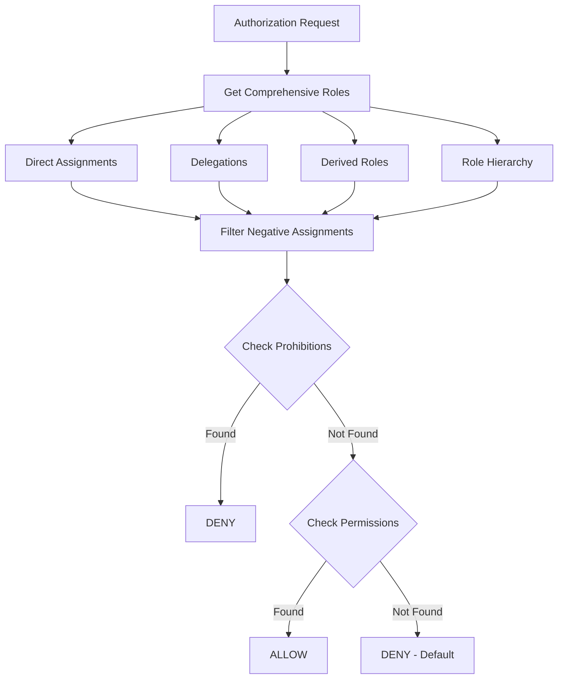
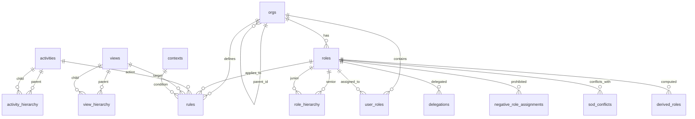
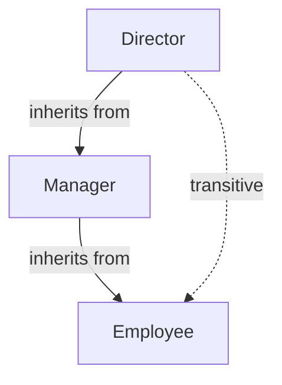

# pg_morbac Documentation

Complete technical documentation for the Multi-OrBAC PostgreSQL extension.

## Table of Contents

- [Architecture](#architecture)
- [Schema Reference](#schema-reference)
- [Core Concepts](#core-concepts)
- [Advanced Features](#advanced-features)
- [API Reference](#api-reference)
- [Integration Guides](#integration-guides)
- [Performance](#performance)
- [Security Model](#security-model)

## Architecture

### Design Principles

pg_morbac is built on these principles:

1. **Pure PostgreSQL** - No external dependencies (except pgcrypto)
2. **Schema Isolation** - All objects in `morbac` schema
3. **Default Deny** - No permission = access denied
4. **Prohibition Precedence** - Prohibitions checked first, always override permissions
5. **Organization-Centric** - All policies scoped to organizations
6. **Multi-Tenant Native** - Users and resources can span organizations

### Authorization Flow



### Performance Optimizations

**Prohibition-first checking:** Prohibitions are checked before permissions for early exit on denial.

**Indexed foreign keys:** All foreign key relationships have indexes for fast joins.

**Composite indexes:** Optimized indexes for common query patterns (org_id, role_id, activity, view).

**STABLE functions:** RLS functions are marked STABLE for transaction-level caching.

**Recursive CTEs:** Efficient hierarchy traversal using PostgreSQL's recursive common table expressions.

## Schema Reference

### Entity Relationship Diagram



### Core Tables

**morbac.orgs** - Organizations with hierarchy support (`parent_id` self-reference). Unique name required. Supports metadata as JSONB.

**morbac.roles** - Roles scoped to organizations. Unique `(org_id, name)` constraint ensures role names are unique within each org.

**morbac.role_hierarchy** - Role inheritance via `(senior_role_id, junior_role_id)`. Senior roles inherit all junior permissions. Supports transitive closure.

**morbac.user_roles** - Direct user-to-role assignments. Primary key on `(user_id, role_id, org_id)`. Note: `user_id` is external (application manages users).

**morbac.activities** - Abstract actions (global scope). Text primary key. Examples: `read`, `write`, `delete`, `approve`.

**morbac.activity_hierarchy** - Activity inheritance via `(parent_activity, child_activity)`. Permission to parent grants child activities.

**morbac.views** - Abstract object categories (global scope). Text primary key. Examples: `documents`, `reports`, `financial_data`.

**morbac.view_hierarchy** - View inheritance via `(parent_view, child_view)`. Access to parent grants child views.

**morbac.contexts** - Contextual conditions as callable predicates. Column `evaluator` (REGPROC) references a function returning BOOLEAN (preferably STABLE). Built-in context `always` returns true.

**morbac.rules** - Core policy rules linking org, role, activity, view, context, and modality. Indexed on `(org_id, role_id, activity, view, modality)` for fast lookups.

**morbac.policy** - Policy DSL using names instead of UUIDs. Insert here, then call `compile_policy()` to generate rules.

### Advanced Feature Tables

#### morbac.delegations

Temporal role delegation.

```sql
CREATE TABLE morbac.delegations (
    id UUID PRIMARY KEY DEFAULT gen_random_uuid(),
    delegator_user_id UUID NOT NULL,
    delegate_user_id UUID NOT NULL,
    role_id UUID NOT NULL REFERENCES morbac.roles(id) ON DELETE CASCADE,
    org_id UUID NOT NULL REFERENCES morbac.orgs(id) ON DELETE CASCADE,
    valid_from TIMESTAMPTZ NOT NULL DEFAULT now(),
    valid_until TIMESTAMPTZ,
    created_at TIMESTAMPTZ NOT NULL DEFAULT now(),
    CHECK (valid_until IS NULL OR valid_until > valid_from)
);
```

**Columns:**
- `valid_from` - Delegation start time
- `valid_until` - Optional end time (NULL = indefinite)

**Automatic handling:** Included in `get_comprehensive_roles()` when active.

#### morbac.negative_role_assignments

Explicit role prohibitions.

```sql
CREATE TABLE morbac.negative_role_assignments (
    user_id UUID NOT NULL,
    role_id UUID NOT NULL REFERENCES morbac.roles(id) ON DELETE CASCADE,
    org_id UUID NOT NULL REFERENCES morbac.orgs(id) ON DELETE CASCADE,
    reason TEXT,
    created_at TIMESTAMPTZ NOT NULL DEFAULT now(),
    PRIMARY KEY (user_id, role_id, org_id)
);
```

**Precedence:** Overrides direct assignments, delegations, and derived roles.

#### morbac.sod_conflicts

Separation of Duty constraints.

```sql
CREATE TABLE morbac.sod_conflicts (
    id UUID PRIMARY KEY DEFAULT gen_random_uuid(),
    role1_id UUID NOT NULL REFERENCES morbac.roles(id) ON DELETE CASCADE,
    role2_id UUID NOT NULL REFERENCES morbac.roles(id) ON DELETE CASCADE,
    org_id UUID NOT NULL REFERENCES morbac.orgs(id) ON DELETE CASCADE,
    description TEXT,
    created_at TIMESTAMPTZ NOT NULL DEFAULT now(),
    UNIQUE(role1_id, role2_id, org_id),
    CHECK (role1_id < role2_id)
);
```

**Usage:** Validated via `check_sod_violation()` before role assignment.

#### morbac.role_cardinality

Min/max users per role.

```sql
CREATE TABLE morbac.role_cardinality (
    role_id UUID PRIMARY KEY REFERENCES morbac.roles(id) ON DELETE CASCADE,
    org_id UUID NOT NULL REFERENCES morbac.orgs(id) ON DELETE CASCADE,
    min_users INTEGER NOT NULL DEFAULT 0,
    max_users INTEGER,
    created_at TIMESTAMPTZ NOT NULL DEFAULT now(),
    CHECK (min_users >= 0),
    CHECK (max_users IS NULL OR max_users >= min_users)
);
```

**Usage:** Validated via `check_cardinality_violation()`.

#### morbac.derived_roles

Dynamically computed roles.

```sql
CREATE TABLE morbac.derived_roles (
    id UUID PRIMARY KEY DEFAULT gen_random_uuid(),
    role_id UUID NOT NULL REFERENCES morbac.roles(id) ON DELETE CASCADE,
    org_id UUID NOT NULL REFERENCES morbac.orgs(id) ON DELETE CASCADE,
    evaluator REGPROC NOT NULL,
    description TEXT,
    created_at TIMESTAMPTZ NOT NULL DEFAULT now()
);
```

**Columns:**
- `evaluator` - Function returning `TABLE(user_id UUID, org_id UUID)`

#### morbac.cross_org_rules

Inter-organizational rules.

```sql
CREATE TABLE morbac.cross_org_rules (
    id UUID PRIMARY KEY DEFAULT gen_random_uuid(),
    source_org_id UUID NOT NULL REFERENCES morbac.orgs(id) ON DELETE CASCADE,
    target_org_id UUID NOT NULL REFERENCES morbac.orgs(id) ON DELETE CASCADE,
    role_id UUID NOT NULL REFERENCES morbac.roles(id) ON DELETE CASCADE,
    activity TEXT NOT NULL REFERENCES morbac.activities(name) ON DELETE CASCADE,
    view TEXT NOT NULL REFERENCES morbac.views(name) ON DELETE CASCADE,
    modality morbac.modality NOT NULL,
    created_at TIMESTAMPTZ NOT NULL DEFAULT now()
);
```

**Usage:** Allows roles in `source_org` to access resources in `target_org`.

#### morbac.admin_rules

Administration meta-policies.

```sql
CREATE TABLE morbac.admin_rules (
    id UUID PRIMARY KEY DEFAULT gen_random_uuid(),
    org_id UUID NOT NULL REFERENCES morbac.orgs(id) ON DELETE CASCADE,
    role_id UUID NOT NULL REFERENCES morbac.roles(id) ON DELETE CASCADE,
    can_manage_policies BOOLEAN NOT NULL DEFAULT false,
    can_manage_roles BOOLEAN NOT NULL DEFAULT false,
    can_manage_users BOOLEAN NOT NULL DEFAULT false,
    created_at TIMESTAMPTZ NOT NULL DEFAULT now(),
    UNIQUE(org_id, role_id)
);
```

## Core Concepts

### Deontic Modalities

Multi-OrBAC implements four modalities:

1. **Permission** - Allows action (if no prohibition)
2. **Prohibition** - Denies action (always wins)
3. **Obligation** - Must be done (informational only)
4. **Recommendation** - Should be done (informational only)

Only permissions and prohibitions affect `is_allowed()` decisions.

### Context Evaluation

Contexts are boolean predicates that determine if a rule applies:

```sql
-- Context function signature
CREATE OR REPLACE FUNCTION morbac.my_context()
RETURNS BOOLEAN
LANGUAGE plpgsql
STABLE  -- Important for RLS performance
AS $$
BEGIN
    RETURN <condition>;
END;
$$;

-- Register context
INSERT INTO morbac.contexts (name, evaluator) VALUES
    ('my_context', 'morbac.my_context'::regproc);
```

Context functions should:

- Use STABLE (not VOLATILE) for RLS compatibility
- Keep logic simple and fast
- Avoid external dependencies
- Consider caching if computation is expensive

### Policy DSL

Simplified policy declaration:

```sql
-- Insert policies using names
INSERT INTO morbac.policy (org_name, role_name, activity, view, modality) VALUES
    ('Acme Corp', 'manager', 'approve', 'requests', 'permission');

-- Compile (idempotent)
SELECT * FROM morbac.compile_policy();
```

Compiler behavior:
- Creates missing activities/views
- Resolves names to UUIDs
- Creates entries in `morbac.rules`
- Reports errors for missing orgs/roles/contexts
- Safe to run multiple times

## Advanced Features

### Hierarchies

Organizations, roles, activities, and views all support hierarchical relationships with transitive closure.

```sql
-- Organization hierarchy (via parent_id)
INSERT INTO morbac.orgs (name, parent_id) VALUES ('EMEA', parent_org_id);
SELECT * FROM morbac.get_org_ancestors(org_id);
SELECT * FROM morbac.get_org_descendants(org_id);

-- Role hierarchy (senior inherits from junior)
INSERT INTO morbac.role_hierarchy (senior_role_id, junior_role_id)
VALUES (manager_role_id, employee_role_id);
SELECT * FROM morbac.get_inherited_roles(role_id);

-- Activity hierarchy (parent includes children)
INSERT INTO morbac.activity_hierarchy (parent_activity, child_activity)
VALUES ('write', 'create'), ('write', 'update');
SELECT * FROM morbac.get_effective_activities('write');

-- View hierarchy (parent includes children)
INSERT INTO morbac.view_hierarchy (parent_view, child_view)
VALUES ('documents', 'invoices'), ('documents', 'contracts');
SELECT * FROM morbac.get_effective_views('documents');
```

Example hierarchy diagram:



### Delegation

Temporary role delegation with time bounds:

```sql
INSERT INTO morbac.delegations (
    delegator_user_id, delegate_user_id, role_id, org_id,
    valid_from, valid_until
) VALUES (
    alice_uuid, bob_uuid, approver_role_id, org_id,
    NOW(), NOW() + INTERVAL '7 days'
);
```

Automatically included in `get_comprehensive_roles()` when active. Set `valid_until` to NULL for indefinite delegation.

### Negative Role Assignments

Explicit prohibitions with highest precedence:

```sql
INSERT INTO morbac.negative_role_assignments (user_id, role_id, org_id, reason)
VALUES (user_uuid, admin_role_id, org_id, 'Security audit requirement');
```

### Separation of Duty

Mutually exclusive role constraints:

```sql
INSERT INTO morbac.sod_conflicts (role1_id, role2_id, org_id, description)
VALUES (preparer_role_id, approver_role_id, org_id, 'Cannot prepare and approve same transaction');

SELECT morbac.check_sod_violation(user_uuid, org_id);
```

### Cardinality Constraints

Min/max users per role:

```sql
INSERT INTO morbac.role_cardinality (role_id, org_id, min_users, max_users)
VALUES (admin_role_id, org_id, 1, 3);

SELECT morbac.check_cardinality_violation(admin_role_id, org_id);
```
Check before INSERT INTO user_roles
```sql
-- Require 1-3 admins
INSERT INTO morbac.role_cardinality (role_id, org_id, min_users, max_users)
VALUES (admin_role_id, org_id, 1, 3);

-- Validate
SELECT morbac.check_cardinality_violation(admin_role_id, org_id);
-- Returns: TEXT (error message) or NULL (valid)
```

### Derived Roles

```sql
-- Define evaluator
### Derived Roles

Dynamically computed roles via custom functions:

```sql
CREATE OR REPLACE FUNCTION morbac.eval_project_leads()
RETURNS TABLE(user_id UUID, org_id UUID)
LANGUAGE sql STABLE AS $$
    SELECT user_id, org_id FROM app.projects WHERE lead_user_id IS NOT NULL;
$$;

INSERT INTO morbac.derived_roles (role_id, org_id, evaluator)
VALUES (project_lead_role_id, org_id, 'morbac.eval_project_leads'::regproc);
```

### Cross-Organizational Rules

Inter-organizational access policies:

```sql
INSERT INTO morbac.cross_org_rules (
    source_org_id, target_org_id, role_id, activity, view, modality
) VALUES (
    global_org_id, subsidiary_org_id, auditor_role_id,
    'read', 'financial_reports', 'permission'
);
```

### Administration Rules

Meta-policies for policy management:

```sql
INSERT INTO morbac.admin_rules (org_id, role_id, can_manage_policies)
VALUES (org_id, sec_admin_role_id, true);

SELECT morbac.is_admin_allowed(user_uuid, org_id, 'manage_policies');
```

### Temporal Constraints

Rules and cross-organizational rules support optional temporal validity periods. Rules are only active within their specified time window.

**Adding temporal constraints to rules:**

```sql
-- Rule active only in 2024
INSERT INTO morbac.rules (org_id, role_id, activity, view, context_id, modality, valid_from, valid_until)
VALUES (org_id, contractor_role_id, 'read', 'projects', ctx_id, 'permission',
        '2024-01-01 00:00:00+00', '2024-12-31 23:59:59+00');

-- Rule active starting from a specific date (no end date)
INSERT INTO morbac.rules (org_id, role_id, activity, view, context_id, modality, valid_from)
VALUES (org_id, employee_role_id, 'read', 'handbook', ctx_id, 'permission',
        '2024-06-01 00:00:00+00');

-- Rule expires at a specific date
INSERT INTO morbac.rules (org_id, role_id, activity, view, context_id, modality, valid_until)
VALUES (org_id, temp_role_id, 'write', 'reports', ctx_id, 'permission',
        '2024-12-31 23:59:59+00');
```

**Temporal constraints on cross-org rules:**

```sql
INSERT INTO morbac.cross_org_rules (
    source_org_id, target_org_id, role_id, activity, view, modality,
    valid_from, valid_until
) VALUES (
    parent_org_id, subsidiary_org_id, auditor_role_id,
    'read', 'financial_data', 'permission',
    '2024-01-01 00:00:00+00', '2024-03-31 23:59:59+00'
);
```

**Checking rule validity manually:**

```sql
SELECT morbac.is_rule_valid(valid_from, valid_until);
-- Returns: TRUE if current time is within bounds (or no constraints set)
--          FALSE if outside validity period
```

**Behavior:**
- Both `valid_from` and `valid_until` are optional (can be NULL)
- If both are NULL, rule is always active
- If only `valid_from` is set, rule is active from that time onwards
- If only `valid_until` is set, rule is active until that time
- If both are set, rule is active only during that window
- `is_allowed()` automatically checks temporal validity for all rules
- Expired rules are effectively inactive but remain in database for audit purposes

### Audit Logging

Comprehensive audit trail for security-critical operations. The audit system tracks all INSERT, UPDATE, and DELETE operations on specified tables.

**Audit log table structure:**

```sql
morbac.audit_log (
    id              BIGSERIAL PRIMARY KEY,
    timestamp       TIMESTAMPTZ,      -- When change occurred
    user_id         UUID,             -- User making change (if applicable)
    org_id          UUID,             -- Organization context
    table_name      TEXT,             -- Table being modified
    operation       TEXT,             -- INSERT, UPDATE, DELETE
    record_id       UUID,             -- ID of affected record
    old_data        JSONB,            -- Record state before change (UPDATE/DELETE)
    new_data        JSONB,            -- Record state after change (INSERT/UPDATE)
    changed_fields  TEXT[],           -- List of modified columns (UPDATE)
    session_user    TEXT,             -- PostgreSQL session user
    client_addr     INET,             -- Client IP address
    application_name TEXT,            -- Application name from connection
    metadata        JSONB             -- Additional custom metadata
)
```

**Enabling audit logging:**

```sql
-- Enable auditing on user_roles table
SELECT morbac.enable_audit('user_roles');

-- Enable auditing on multiple tables
SELECT morbac.enable_audit('rules');
SELECT morbac.enable_audit('delegations');
SELECT morbac.enable_audit('admin_rules');
```

**Disabling audit logging:**

```sql
SELECT morbac.disable_audit('user_roles');
```

**Querying audit log:**

```sql
-- Recent changes to user_roles
SELECT
    timestamp,
    operation,
    session_user,
    old_data->>'role_id' AS old_role,
    new_data->>'role_id' AS new_role
FROM morbac.audit_log
WHERE table_name = 'user_roles'
ORDER BY timestamp DESC
LIMIT 20;

-- All changes by specific user
SELECT * FROM morbac.audit_log
WHERE user_id = '123e4567-e89b-12d3-a456-426614174000'
ORDER BY timestamp DESC;

-- Changes to specific record
SELECT * FROM morbac.audit_log
WHERE table_name = 'rules' AND record_id = rule_uuid
ORDER BY timestamp;

-- Detect field-level changes
SELECT
    timestamp,
    record_id,
    changed_fields,
    old_data,
    new_data
FROM morbac.audit_log
WHERE table_name = 'rules'
  AND operation = 'UPDATE'
  AND 'modality' = ANY(changed_fields);
```

**Best practices:**
- Enable auditing on security-critical tables: `user_roles`, `rules`, `delegations`, `admin_rules`, `sod_conflicts`
- Create indexes on frequently queried columns: `CREATE INDEX ON morbac.audit_log(table_name, timestamp DESC)`
- Implement retention policies to archive old audit logs
- Use JSONB operators to query `old_data` and `new_data` efficiently
- Consider partitioning `audit_log` by timestamp for large installations

## API Reference

### Authorization Functions

**`is_allowed(user_id, org_id, activity, view)`** - Main authorization decision. Returns BOOLEAN. Checks prohibitions first, then permissions, defaults to deny.

```sql
SELECT morbac.is_allowed(user_uuid, org_uuid, 'read', 'documents');
```

**`get_comprehensive_roles(user_id, org_id)`** - Returns all roles for user (direct, delegated, derived, hierarchy, minus negative assignments).

**`get_effective_roles(user_id, org_id)`** - Alias for `get_comprehensive_roles()`.

### Hierarchy Functions

**`get_org_ancestors(org_id)`** - Returns all parent organizations with depth.

**`get_org_descendants(org_id)`** - Returns all child organizations with depth.

**`get_inherited_roles(role_id)`** - Returns all junior roles (transitive).

**`get_effective_activities(activity)`** - Returns activity plus all child activities.

**`get_effective_views(view)`** - Returns view plus all child views.

### Validation Functions

**`check_sod_violation(user_id, org_id)`** - Returns TEXT[] of conflicting role pairs or empty array.

**`check_cardinality_violation(role_id, org_id)`** - Returns error message or NULL if valid.

### Administration Functions

**`is_admin_allowed(user_id, org_id, capability)`** - Check administrative permissions. Capabilities: `manage_policies`, `manage_roles`, `manage_users`.

**`eval_derived_role(user_id, org_id, derived_role_id)`** - Evaluate if user has derived role.

### Context Functions

**`eval_context(context_id)`** - Evaluate a context predicate.

### Policy DSL Functions

**`compile_policy()`** - Compile policy DSL into rules. Returns TABLE with success status and messages. Idempotent.

### RLS Helper Functions

**`current_user_id()`** - Get user ID from `request.header.x-user-id` (PostgREST) or `current_setting('morbac.user_id')`.

**`current_org_id()`** - Get org ID from `request.header.x-org-id` (PostgREST) or `current_setting('morbac.org_id')`.

**`rls_check(activity, view)`** - Authorization check for RLS policies using current user/org context.

```sql
CREATE POLICY my_policy ON app.table
FOR SELECT USING (morbac.rls_check('read', 'documents'));
```

### Informational Functions

**`pending_obligations(user_id, org_id)`** - Returns obligations for user (informational only).

**`pending_recommendations(user_id, org_id)`** - Returns recommendations for user (informational only).

**`user_has_role(user_id, org_id, role_name)`** - Check if user has specific role by name.

```sql
morbac.user_has_role(
    p_user_id UUID,
    p_org_id UUID,
    p_role_name TEXT
) RETURNS BOOLEAN
```

## Integration Guides

### PostgREST Integration

#### 1. Setup Headers

Configure PostgREST to pass user/org context:

```nginx
# Nginx config
proxy_set_header X-User-Id $user_id;
proxy_set_header X-Org-Id $org_id;
```

#### 2. Enable RLS

```sql
ALTER TABLE app.documents ENABLE ROW LEVEL SECURITY;

-- Grant usage to PostgREST role
GRANT USAGE ON SCHEMA morbac TO postgrest_role;
GRANT SELECT ON ALL TABLES IN SCHEMA morbac TO postgrest_role;
GRANT EXECUTE ON ALL FUNCTIONS IN SCHEMA morbac TO postgrest_role;
```

#### 3. Create RLS Policies

```sql
CREATE POLICY document_read ON app.documents
FOR SELECT
USING (morbac.rls_check('read', 'documents'));

CREATE POLICY document_write ON app.documents
FOR INSERT
WITH CHECK (morbac.rls_check('write', 'documents'));
```

#### 4. Set Context (alternative to headers)

```sql
-- In application connection
SET morbac.user_id = '123e4567-e89b-12d3-a456-426614174000';
SET morbac.org_id = '987fcdeb-51a2-43d7-9c6e-5a8b7c9d0e1f';
```

## Integration Guides

### PostgREST Integration

Configure PostgREST to pass headers, enable RLS, and create policies:

```sql
-- Enable RLS
ALTER TABLE app.documents ENABLE ROW LEVEL SECURITY;

GRANT USAGE ON SCHEMA morbac TO postgrest_role;
GRANT SELECT ON ALL TABLES IN SCHEMA morbac TO postgrest_role;
GRANT EXECUTE ON ALL FUNCTIONS IN SCHEMA morbac TO postgrest_role;

-- Create RLS policies
CREATE POLICY document_read ON app.documents
FOR SELECT USING (morbac.rls_check('read', 'documents'));

-- Alternative: Set context directly
SET morbac.user_id = '123e4567...';
SET morbac.org_id = '987fcdeb...';
```

### Application Integration

Python example:

```python
import psycopg2
conn = psycopg2.connect("dbname=mydb")
cursor = conn.cursor()
cursor.execute("SET morbac.user_id = %s", [user_id])
cursor.execute("SET morbac.org_id = %s", [org_id])
cursor.execute("SELECT * FROM app.documents")  # RLS enforced
```

Node.js example:

```javascript
const client = await pool.connect();
await client.query('SET morbac.user_id = $1', [userId]);
await client.query('SET morbac.org_id = $1', [orgId]);
const res = await client.query('SELECT * FROM app.documents');
```

### Multi-Organization Resources

Resources can belong to multiple organizations:

```sql
CREATE TABLE app.document_orgs (
    document_id UUID,
    org_id UUID,
    PRIMARY KEY (document_id, org_id)
);

CREATE POLICY doc_access ON app.documents FOR SELECT USING (
    EXISTS (SELECT 1 FROM app.document_orgs
            WHERE document_id = app.documents.id
              AND org_id = morbac.current_org_id())
    AND morbac.rls_check('read', 'documents')
);
```

## Performance

### Optimization Strategies

Prohibition-first checking provides early exit on denial for both security and performance.

For large hierarchies, use materialized views:

```sql
CREATE MATERIALIZED VIEW morbac.mv_role_closure AS
SELECT senior_role_id, junior_role_id FROM ...;
CREATE INDEX ON morbac.mv_role_closure(senior_role_id);
REFRESH MATERIALIZED VIEW morbac.mv_role_closure;
```

Context optimization:
- Use STABLE functions (not VOLATILE) for RLS caching
- Avoid expensive computations or external calls
- Keep context logic simple

All foreign keys are indexed. Critical composite indexes exist on `(user_id, org_id)` and `(org_id, role_id, activity, view, modality)`.
CREATE INDEX idx_rules_lookup ON morbac.rules(org_id, role_id, activity, view, modality);

-- Hierarchy traversal
CREATE INDEX idx_role_hierarchy_senior ON morbac.role_hierarchy(senior_role_id);
CREATE INDEX idx_role_hierarchy_junior ON morbac.role_hierarchy(junior_role_id);
```

### Benchmarking

Example query performance (1M rules, 10K users, 100 orgs):

```sql
-- Simple authorization check
EXPLAIN ANALYZE
SELECT morbac.is_allowed(user_id, org_id, 'read', 'documents');
-- Typical: 5-15ms

-- With hierarchies (3 levels)
EXPLAIN ANALYZE
SELECT morbac.is_allowed(user_id, org_id, 'read', 'documents');
-- Typical: 10-30ms

-- RLS query (1M rows)
EXPLAIN ANALYZE
SELECT * FROM app.documents WHERE morbac.rls_check('read', 'documents');
-- Depends on selectivity, uses indexes
```

## Security Model

### Threat Model

Protected against:
- Unauthorized access (default deny)
- Privilege escalation (prohibition precedence)
- SQL injection (parameterized queries)
- Org boundary violations (explicit cross-org rules)

Not protected against:
- Malicious context functions (trusted code)
- Database user privilege escalation (PostgreSQL security model)
- Time-of-check/time-of-use races (transaction-based consistency only)

### Security Best Practices

#### 1. Context Function Security

```sql
-- BAD: Leaks information
CREATE FUNCTION morbac.bad_context()
RETURNS BOOLEAN VOLATILE AS $$
    SELECT EXISTS(SELECT 1 FROM sensitive_table);
$$;

-- GOOD: Self-contained, stable
CREATE FUNCTION morbac.good_context()
RETURNS BOOLEAN STABLE AS $$
    SELECT EXTRACT(HOUR FROM CURRENT_TIME) BETWEEN 9 AND 17;
$$;
```

#### 2. User ID Validation

```sql
-- Validate user exists before authorization
SELECT morbac.is_allowed(
    user_id,  -- Must be from authenticated session
    org_id,
    activity,
    view
);
```

#### 3. Org Context Validation

```sql
-- Verify user belongs to org
SELECT EXISTS(
    SELECT 1 FROM morbac.user_roles
    WHERE user_id = ? AND org_id = ?
);
```

#### 4. Delegation Auditing

```sql
-- Log delegations
CREATE TABLE app.delegation_audit (
    delegation_id UUID REFERENCES morbac.delegations(id),
    action TEXT,
    by_user UUID,
    at_time TIMESTAMPTZ DEFAULT now()
);
```

### Comparison: Multi-OrBAC vs Traditional RBAC

| Aspect | Traditional RBAC | Multi-OrBAC (pg_morbac) |
|--------|-----------------|-------------------------|
| **Multi-tenancy** | Single tenant or complex workarounds | Native multi-organization |
| **Prohibition** | No standard support | First-class, always wins |
| **Context** | Static permissions | Dynamic, condition-based |
| **Hierarchy** | Basic (roles only) | Full (orgs, roles, activities, views) |
| **Delegation** | Manual implementation | Native temporal delegation |
| **SoD** | Application logic | Database-enforced constraints |
| **Cross-tenant** | Not supported | Native cross-org rules |
| **Audit** | Application layer | Meta-policies (admin rules) |

---

## Additional Resources

- [Multi-OrBAC Research Paper](https://webhost.laas.fr/TSF/deswarte/Publications/06427.pdf)
- [test_morbac.sql](test_morbac.sql) - Comprehensive examples
- [CHANGELOG.md](CHANGELOG.md) - Version history
- [CONTRIBUTING.md](CONTRIBUTING.md) - Contribution guidelines
- [SECURITY.md](SECURITY.md) - Security policy
